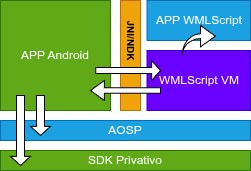

# Día 1 – Contexto y Arquitectura de Browser

---

## Objetivos del Día
- Conocer el **producto Browser** y su rol en la aceptación de pagos.  
- Comprender la **arquitectura general**: App Android + NDK + VM WMLScript.  
- Revisar los **repositorios y herramientas de build**.  
- Ejecutar un **primer laboratorio** con la VM.  

---

## Flujo de Uso del Browser
- El **Browser** ejecuta apps escritas en **WMLScript**.  
- Estas apps permiten **aceptar pagos con tarjeta**.  
- El flujo típico:  
  1. Merchant inicia app en Android.  
  2. Browser carga y ejecuta script en la VM.  
  3. VM gestiona interacción con tarjeta / periféricos.  
  4. Resultado mostrado en Android.  

---

## Arquitectura – Vista General

 

- **App Android (Java)**  
- **NDK / JNI**  
- **VM WMLScript (C)**  
- **App WMLScript**

---

## Arquitectura – Vista General

 

- **App Android (Java)**  
  - Interfaz gráfica.  
  - Control del ciclo de vida.  
  - Ofrece APIs hacia Android y sdk privativo

---

## Arquitectura – Vista General

 

- **NDK / JNI**  
  - Puente entre Android y C.  
  - Permite llamar funciones nativas.  

---

## Arquitectura – Vista General

 

- **VM WMLScript (C)**  
  - Ejecuta bytecode WMLScript.  

---

## Arquitectura – Vista General

 

- **App WMLScript**
  - Define el flujo de la aplicación.
  - Implementa reglas de negocio.

---

## Integración con Periféricos
- **TCP/IP**  
  - Conexión con hosts de pago o sistemas bancarios.  
  - WIFI/ETHERNET/GPRS
- **EMV**  
  - Procesamiento de transacciones contacto y contactless.  
- **Banda magnética**

---

## Qué es WMLScript

- Alto nivel.
- Interpretado.
- Simple.
- Subset de Javascript.

---

## Repositorios

- git@git.tpvsolutions.com.mx:mbrowserandroid.git

- git@github.com:angeles-ricardo-89/curso-tpv-2025-labs.git

---

## Repositorios y Build
- Revisión de la estructura
- Herramientas necesarias 
  - **Android Studio** con NDK.  
  - **Gradle** para compilación.  
  - Dispositivo o emulador para pruebas.  

---

## Laboratorio Día 1
1. Clonar el repositorio del Browser.  
2. Clonar el repositorio de labs
3. Compilar el browser
4. Compilar la app demo
5. Compilar y desplegar la app en un dispositivo Android.  
6. Observar el flujo:  
   - Android → JNI → VM → resultado en UI.  

---

## Cierre del Día
- Ya conoces la **arquitectura general** del Browser.  
- Probaste tu **primer flujo WMLScript en la VM**.  
- Estás listo para adentrarte en **C aplicado al producto** (Día 2).  

## Laboratorio Adicional
1. Seguir las instrucciones del laboratorio Dia1/lab2
2. En la carpeta Dia1/lab2/soluciones crear una carpeta con su nombre
3. Crear un pull request con la solución
